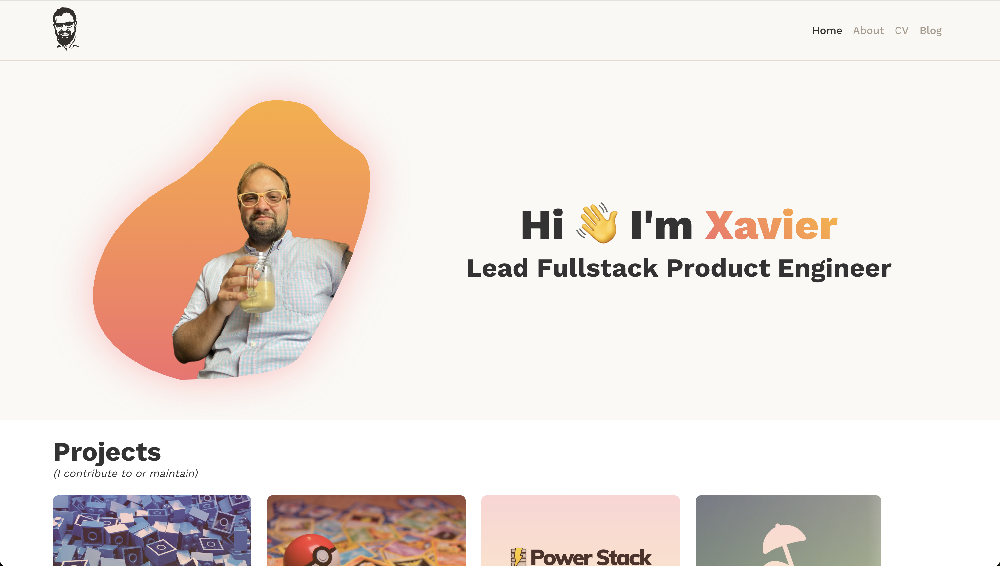

Having not touched the design and technology of my website for about 3 years I decided that now was a great time to update and modernise my site.  In the intervening time since I last touched it a lot has changed for me professionally and in the technology landscape more widely and I wanted the new site to reflect this. When I built v2 I used Gatsby 4 (and then upgraded the site to Gatsby 5) but Gatsby is now been all but relinquished to the preverbal tech graveyard.  It's served me well but I was finding that adapting the tech to where I wanted to take it was becoming more cumbersome as time went on.  
## Design

The first thing I wanted to evolve was the design.  Having spent a large portion of my time working alongside the Head of Design at IDX, I gained a much better understanding of the mechanics of good design.  While I am definitely not a designer, I was able to apply these principles and achieve results I'm happy with.  

The previous iteration was quite minimal and built on top of a Gatsby theme which gave me limited flexibility to expand on.  I wanted the new design to be fresher and more vibrant but also built on top of vanilla React components that could be extended or reworked in future.
## The tech

For the tech I opted for a more modern approach.  The site is built using Next.js 14 and is all Typescript based.  The data is all stored statically with MDX files.  I've been thinking about ways that I can improve the site in future and I would like to see ways of adding Puck for true "Drag and Drop" capabilities but for now I trialing Obsidian as my MDX editor.
## Blogs

Perhaps the biggest new feature for this site is how I've added my blog posts to the site.  Seeing the way that Twitter/X has evolved has highlighted to me the fragility of keeping your data with a third party.  Previously, all of my posts were kept on Medium while this is a great platform to help expand your audience I wasn't comfortable that this was my only archive of my history throughout my career.  

While I have brought all my blogs over to my site and while be using this as the source of truth in future, I still plan on syndicating and sharing with Medium. 

## In conclusion

As always this website remains a place for me to share my ideas, thoughts and findings throughout my career.  It's also a great way to trial new technology and particularly the ease (or not) of migrating to the latest and greatest tech.  